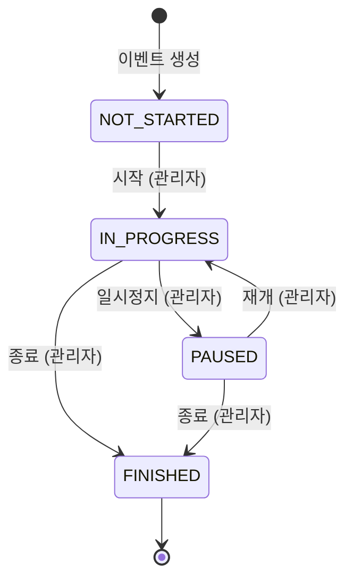
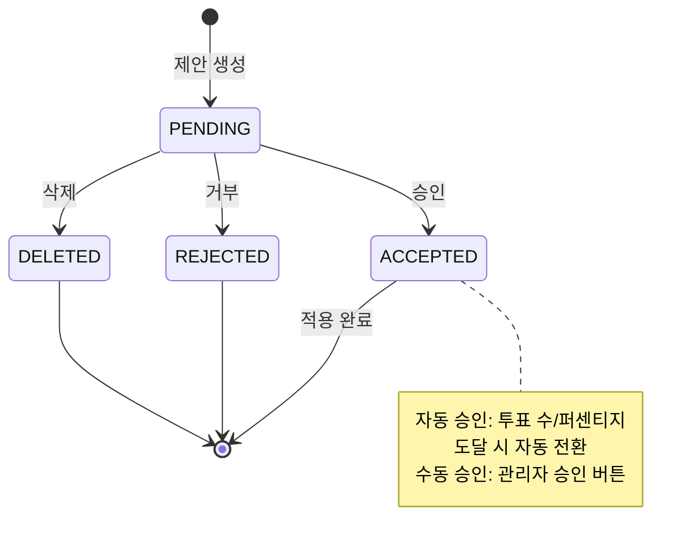
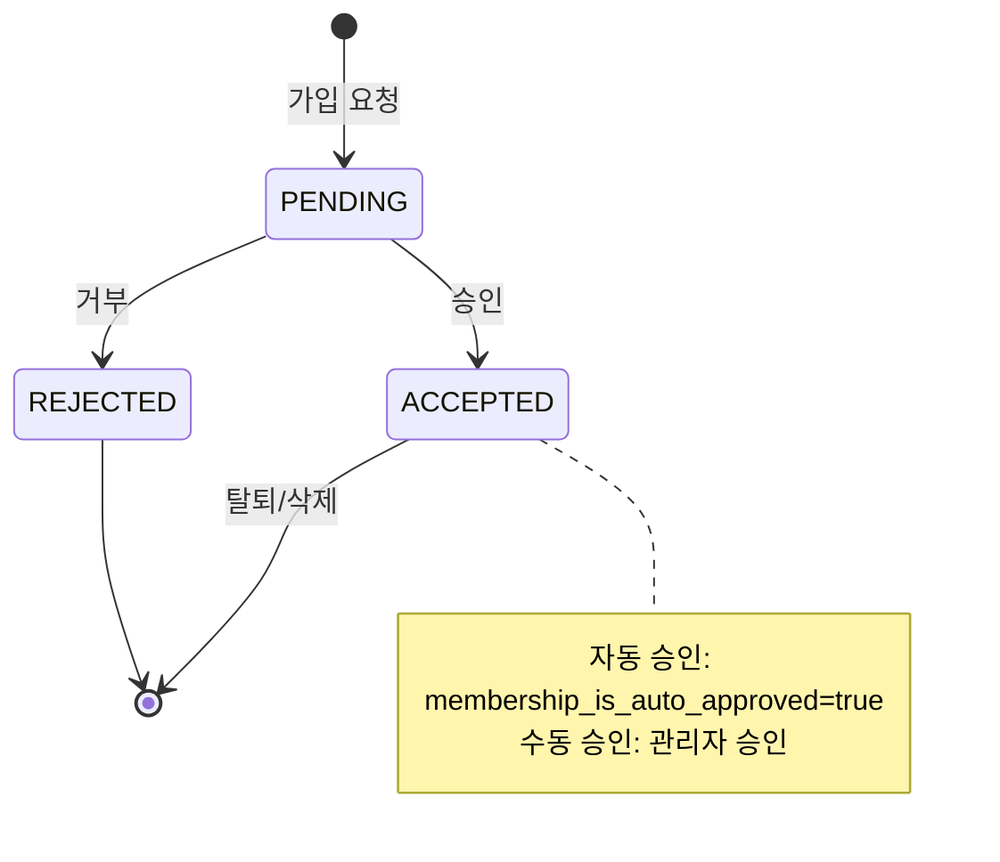

# Database Schema

## User Defined Type

### event_status_type
- NOT_STARTED
- IN_PROGRESS
- PAUSED
- FINISHED

### proposal_status_type
- PENDING
- ACCEPTED
- REJECTED
- DELETED

### proposal_category_type
- CREATION
- MODIFICATION
- DELETION

### membership_status_type
- PENDING
- ACCEPTED
- REJECTED

## 상태 전이 다이어그램

### Event Status 전이

### Proposal Status 전이

### Membership Status 전이

## Tables

### users
- id: uuid, PK
- (기타 사용자 필드들은 auth 모듈에서 정의)

### events
- id: uuid, PK
- decision_subject: text, NOT NULL
- entrance_code: text, NOT NULL
- assumption_is_auto_approved_by_votes: boolean, default true, NOT NULL
- criteria_is_auto_approved_by_votes: boolean, default true, NOT NULL
- membership_is_auto_approved: boolean, default true, NOT NULL
- assumption_min_votes_required: integer, NULL
- criteria_min_votes_required: integer, NULL
- conclusion_is_auto_approved_by_votes: boolean, default true, NOT NULL
- conclusion_approval_threshold_percent, integer, NULL
- event_status: event_status_type(UDT), NOT NULL
- max_membership: integer, NOT NULL
- created_at: timestamp with time zone, NOT NULL
- updated_at: timestamp with time zone, NULL
- admin_id: uuid, FK(users.id), NOT NULL

**제약 조건:**
- UNIQUE: entrance_code - 각 event마다 고유한 접속 코드
- CHECK: LENGTH(entrance_code) = 6 - 접속 코드는 정확히 6자리
- CHECK: entrance_code ~ '^[A-Z0-9]{6}$' - 접속 코드 형식 검증
- CHECK: max_membership > 0 - 최대 멤버 수는 1명 이상이어야 함
- CHECK: assumption_is_auto_approved_by_votes = true → assumption_min_votes_required IS NOT NULL
- CHECK: criteria_is_auto_approved_by_votes = true → criteria_min_votes_required IS NOT NULL
- CHECK: conclusion_is_auto_approved_by_votes = true → conclusion_approval_threshold_percent IS NOT NULL
- CHECK: conclusion_approval_threshold_percent IS NULL OR (conclusion_approval_threshold_percent >= 1 AND conclusion_approval_threshold_percent <= 100)

**인덱스:**
- idx_events_admin_id: admin_id

**설명:**
- event는 방(room) 역할을 함 (1:1 매칭이므로 별도 rooms 테이블 불필요)
- decision_subject: 의사결정 주제/제목
- entrance_code: 6자리 랜덤 접속 코드 (대소문자 구분 안 함 권장)
- membership_is_auto_approved: true면 가입 요청 시 자동 승인, false면 admin 승인 필요
- max_membership: event에 참가할 수 있는 최대 멤버 수 (가입 시 현재 멤버 수와 비교하여 제한)
- admin_id는 해당 event의 관리자
- 권한 체크는 서비스 레이어에서 처리

### event_memberships
- id: uuid, PK
- user_id: uuid, FK(users.id, ON DELETE CASCADE), NOT NULL
- event_id: uuid, FK(events.id, ON DELETE CASCADE), NOT NULL
- membership_status: membership_status_type(UDT), DEFAULT 'PENDING', NOT NULL
- created_at: timestamp with time zone, NOT NULL
- updated_at: timestamp with time zone, NULL
- joined_at: timestamp with time zone, NULL

**제약 조건:**
- UNIQUE: (user_id, event_id) - 한 사용자가 같은 event에 중복 가입 불가

**인덱스:**
- idx_event_memberships_event_id: event_id
- idx_event_memberships_user_id: user_id

**설명:**
- event에 사용자 가입 관리
- membership_status:
  - PENDING: 가입 요청 대기 중
  - ACCEPTED: 가입 승인됨 (joined_at에 승인 시점 기록)
  - REJECTED: 가입 거부됨
- admin이 가입을 승인/거부하거나, 자동 승인 정책에 따라 처리
- 가입 시 `events.max_membership` 제한 체크 필요 (현재 ACCEPTED 멤버 수 < max_membership)
- ON DELETE CASCADE: user 또는 event 삭제 시 membership도 함께 삭제

### options
- id: uuid, PK
- event_id: uuid, FK(events.id), NOT NULL
- content: text, NOT NULL
- created_at: timestamp with time zone, NOT NULL
- created_by: uuid, FK(users.id), NOT NULL
- updated_at: timestamp with time zone, NULL

**인덱스:**
- idx_options_event_id: event_id
- idx_options_created_by: created_by

**제약 조건:**
- admin만 추가/수정 가능 (서비스 레이어에서 체크)

**설명:**
- event에 대한 선택지/옵션 (최종 결정을 위한 후보)
- vote_cnt는 제거됨 → COUNT(*)로 계산 (동시성 문제 방지)
- 실제 투표 수는 option_votes 테이블에서 COUNT(*)로 조회

### assumptions
- id: uuid, PK
- event_id: uuid, FK(events.id), NOT NULL
- content: text, NOT NULL
- is_deleted: boolean, NOT NULL, DEFAULT false
- is_modified: boolean, NOT NULL, DEFAULT false
- original_content: text, NULL
- created_at: timestamp with time zone, NOT NULL
- created_by: uuid, FK(users.id), NOT NULL
- updated_at: timestamp with time zone, NULL
- updated_by: uuid, FK(users.id), NULL

**인덱스:**
- idx_assumptions_event_id: event_id
- idx_assumptions_created_by: created_by
- idx_assumptions_updated_by: updated_by

**설명:**
- is_deleted: 삭제 제안이 승인되어 실제로 삭제된 경우 true
- is_modified: 수정 제안이 승인되어 실제로 수정된 경우 true
- original_content: 수정 전 원본 내용 (수정된 경우에만 값이 있음)

### criterion
- id: uuid, PK
- event_id: uuid, FK(events.id), NOT NULL
- content: text, NOT NULL
- conclusion: text, NULL
- is_deleted: boolean, NOT NULL, DEFAULT false
- is_modified: boolean, NOT NULL, DEFAULT false
- original_content: text, NULL
- created_at: timestamp with time zone, NOT NULL
- created_by: uuid, FK(users.id), NOT NULL
- updated_at: timestamp with time zone, NULL
- updated_by: uuid, FK(users.id), NULL

**인덱스:**
- idx_criterion_event_id: event_id
- idx_criterion_created_by: created_by
- idx_criterion_updated_by: updated_by

**설명:**
- conclusion: 각 criterion에 대한 최종 승인된 결론/요약 텍스트
- 각 criterion 별로 conclusion이 있어야 최종 결정에 합리적
- conclusion은 conclusion_proposals에서 승인된 것을 반영
- is_deleted: 삭제 제안이 승인되어 실제로 삭제된 경우 true
- is_modified: 수정 제안이 승인되어 실제로 수정된 경우 true
- original_content: 수정 전 원본 내용 (수정된 경우에만 값이 있음)

### assumption_proposals
- id: uuid, PK
- event_id: uuid, FK(events.id), NOT NULL
- assumption_id: uuid, FK(assumptions.id), NULL
- proposal_status: proposal_status_type, DEFAULT 'PENDING', NOT NULL
- proposal_category: proposal_category_type, NOT NULL
- proposal_content: text, NULL
- reason: text, NULL
- created_at: timestamp with time zone, NOT NULL
- created_by: uuid, FK(users.id), NOT NULL
- accepted_at: timestamp with time zone, NULL
- applied_at: timestamp with time zone, NULL
- applied_target_id: uuid, FK(assumptions.id), NULL

**제약 조건:**
- CHECK: proposal_category = 'CREATION' → assumption_id IS NULL
- CHECK: proposal_category != 'CREATION' → assumption_id IS NOT NULL
- CHECK: proposal_category = 'DELETION' → proposal_content IS NULL
- CHECK: proposal_category != 'DELETION' → proposal_content IS NOT NULL
- **참고**: UNIQUE 제약 조건은 현재 주석 처리되어 있음. 중복 제안 방지는 서비스 레이어에서 처리됨

**인덱스:**
- idx_assumption_proposals_event_id: event_id
- idx_assumption_proposals_assumption_id: assumption_id
- idx_assumption_proposals_created_by: created_by

**설명:**
- accepted_at: 이 제안을 채택하기로 결정한 시점 (정책/합의)
- applied_at: 실제 assumption 테이블에 적용된 시점 (실행/반영)
- applied_target_id:
  - CREATION: 새로 생성된 assumption.id
  - MODIFICATION/DELETION: 기존 assumption_id와 동일
- vote_cnt 제거됨 → COUNT(*)로 계산 (assumption_proposal_votes 테이블에서)

### criteria_proposals
- id: uuid, PK
- event_id: uuid, FK(events.id), NOT NULL
- criteria_id: uuid, FK(criterion.id), NULL
- proposal_status: proposal_status_type, DEFAULT 'PENDING', NOT NULL
- proposal_category: proposal_category_type, NOT NULL
- proposal_content: text, NULL
- reason: text, NULL
- created_at: timestamp with time zone, NOT NULL
- created_by: uuid, FK(users.id), NOT NULL
- accepted_at: timestamp with time zone, NULL
- applied_at: timestamp with time zone, NULL
- applied_target_id: uuid, FK(criterion.id), NULL

**제약 조건:**
- CHECK: proposal_category = 'CREATION' → criteria_id IS NULL
- CHECK: proposal_category != 'CREATION' → criteria_id IS NOT NULL
- CHECK: proposal_category = 'DELETION' → proposal_content IS NULL
- CHECK: proposal_category != 'DELETION' → proposal_content IS NOT NULL
- **참고**: UNIQUE 제약 조건은 현재 주석 처리되어 있음. 중복 제안 방지는 서비스 레이어에서 처리됨

**인덱스:**
- idx_criteria_proposals_event_id: event_id
- idx_criteria_proposals_criteria_id: criteria_id
- idx_criteria_proposals_created_by: created_by

**설명:**
- accepted_at: 이 제안을 채택하기로 결정한 시점 (정책/합의)
- applied_at: 실제 criterion 테이블에 적용된 시점 (실행/반영)
- applied_target_id:
  - CREATION: 새로 생성된 criterion.id
  - MODIFICATION/DELETION: 기존 criteria_id와 동일
- vote_cnt 제거됨 → COUNT(*)로 계산 (criterion_proposal_votes 테이블에서)

### assumption_proposal_votes
- id: uuid, PK
- assumption_proposal_id: uuid, FK(assumption_proposals.id, ON DELETE CASCADE), NOT NULL
- created_at: timestamp with time zone, NOT NULL
- created_by: uuid, FK(users.id), NOT NULL

**제약 조건:**
- UNIQUE: (assumption_proposal_id, created_by) - 중복 투표 방지

**인덱스:**
- idx_assumption_proposal_votes_proposal_id: assumption_proposal_id
- idx_assumption_proposal_votes_created_by: created_by

**설명:**
- 동일 사용자가 동일 proposal에 중복 투표 불가
- ON DELETE CASCADE: proposal 삭제 시 투표도 함께 삭제

### criterion_proposal_votes
- id: uuid, PK
- criterion_proposal_id: uuid, FK(criterion_proposals.id, ON DELETE CASCADE), NOT NULL
- created_at: timestamp with time zone, NOT NULL
- created_by: uuid, FK(users.id), NOT NULL

**제약 조건:**
- UNIQUE: (criterion_proposal_id, created_by) - 중복 투표 방지

**인덱스:**
- idx_criterion_proposal_votes_proposal_id: criterion_proposal_id
- idx_criterion_proposal_votes_created_by: created_by

**설명:**
- 동일 사용자가 동일 proposal에 중복 투표 불가
- ON DELETE CASCADE: proposal 삭제 시 투표도 함께 삭제

### option_votes
- id: uuid, PK
- option_id: uuid, FK(options.id, ON DELETE CASCADE), NOT NULL
- created_at: timestamp with time zone, NOT NULL
- created_by: uuid, FK(users.id), NOT NULL

**제약 조건:**
- UNIQUE: (option_id, created_by) - 중복 투표 방지

**인덱스:**
- idx_option_votes_option_id: option_id
- idx_option_votes_created_by: created_by

**설명:**
- options에 대한 투표
- 동일 사용자가 동일 option에 중복 투표 불가
- ON DELETE CASCADE: option 삭제 시 투표도 함께 삭제

### conclusion_proposals
- id: uuid, PK
- criterion_id: uuid, FK(criterion.id, ON DELETE CASCADE), NOT NULL
- proposal_status: proposal_status_type, DEFAULT 'PENDING', NOT NULL
- proposal_content: text, NOT NULL
- created_at: timestamp with time zone, NOT NULL
- created_by: uuid, FK(users.id), NOT NULL
- accepted_at: timestamp with time zone, NULL
- applied_at: timestamp with time zone, NULL

**제약 조건:**
- **참고**: UNIQUE 제약 조건은 현재 주석 처리되어 있음. 중복 제안 방지는 서비스 레이어에서 처리됨

**인덱스:**
- idx_conclusion_proposals_criterion_id: criterion_id
- idx_conclusion_proposals_created_by: created_by

**설명:**
- 각 criterion에 대한 conclusion 제안
- accepted_at: 이 제안을 채택하기로 결정한 시점
- applied_at: 실제 criterion 테이블의 conclusion 필드에 적용된 시점
- proposal_content가 승인되면 criterion.conclusion에 반영됨
- 기각되면 새로운 제안을 다시 생성하는 방식

### conclusion_proposal_votes
- id: uuid, PK
- conclusion_proposal_id: uuid, FK(conclusion_proposals.id, ON DELETE CASCADE), NOT NULL
- created_at: timestamp with time zone, NOT NULL
- created_by: uuid, FK(users.id), NOT NULL

**제약 조건:**
- UNIQUE: (conclusion_proposal_id, created_by) - 중복 투표 방지

**인덱스:**
- idx_conclusion_proposal_votes_proposal_id: conclusion_proposal_id
- idx_conclusion_proposal_votes_created_by: created_by

**설명:**
- conclusion_proposals에 대한 투표
- 동일 사용자가 동일 proposal에 중복 투표 불가
- ON DELETE CASCADE: proposal 삭제 시 투표도 함께 삭제

### criterion_priorities
- id: uuid, PK
- criterion_id: uuid, FK(criterion.id, ON DELETE CASCADE), NOT NULL
- created_by: uuid, FK(users.id), NOT NULL
- priority_rank: integer, NOT NULL
- created_at: timestamp with time zone, NOT NULL
- updated_at: timestamp with time zone, NULL

**제약 조건:**
- UNIQUE: (criterion_id, created_by) - 사용자당 각 criterion에 하나의 우선순위만 가능
- CHECK: priority_rank > 0

**인덱스:**
- idx_criterion_priorities_criterion_id: criterion_id
- idx_criterion_priorities_created_by: created_by

**설명:**
- 최종 투표 시 사용자가 각 criterion에 부여한 우선순위
- 한 사용자는 각 criterion마다 하나의 우선순위만 부여 가능
- priority_rank: 숫자가 낮을수록 높은 우선순위 (예: 1, 2, 3, ...)
- **정규화**: criterion_id만 사용 (criterion이 이미 event_id를 포함하므로 중복 방지)

### comments
- id: uuid, PK
- criterion_id: uuid, FK(criterion.id, ON DELETE CASCADE), NOT NULL
- content: text, NOT NULL
- created_at: timestamp with time zone, NOT NULL
- created_by: uuid, FK(users.id), NOT NULL
- updated_at: timestamp with time zone, NULL

**인덱스:**
- idx_comments_criterion_id: criterion_id
- idx_comments_created_by: created_by

**설명:**
- criterion에 대한 댓글/의견
- 각 criterion 별로 토론할 수 있도록 함

## 데이터 타입 및 규칙

### timestamp
- 모든 datetime 필드는 `timestamp with time zone` 사용 (PostgreSQL 기준)
- created_at, updated_at 등은 자동으로 현재 시각 설정

### uuid
- 모든 PK는 uuid 사용
- PostgreSQL의 gen_random_uuid() 함수 사용 권장

### 제약 조건 우선순위
1. **DB 제약 (UNIQUE/CHECK/FK)** - 최종 방어선
2. **서비스 레이어 권한 체크** - 비즈니스 로직
3. RLS는 나중에 "DB 직접 접근하는 클라이언트가 늘 때" 도입 고려

### 동시성 고려사항
- vote_cnt 같은 계산된 값은 테이블에 저장하지 않고 COUNT(*)로 계산
- 트랜잭션 내에서 투표 생성/삭제 시 UNIQUE 제약으로 중복 방지